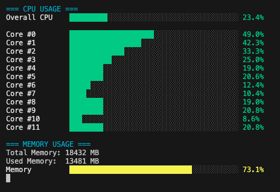

# ezstats

> A lightweight system monitoring tool for your terminal



ezstats is a simple, resource-efficient terminal application that displays real-time CPU, RAM, and GPU usage with a clean and colorful interface. Perfect for keeping an eye on system resources without the overhead of larger monitoring applications.


## Quick Start

### Installation

#### Linux/macOS
```bash
curl -L https://raw.githubusercontent.com/tooyipjee/ezstats/main/install_from_release.sh | bash
```

#### Windows (PowerShell)
```powershell
Invoke-WebRequest -Uri https://raw.githubusercontent.com/tooyipjee/ezstats/main/install_from_release.ps1 -OutFile install_from_release.ps1
.\install_from_release.ps1
```

### Usage

Just type in your terminal:
```
ezstats
```

### Uninstalling

#### Linux/macOS
```bash
curl -L https://raw.githubusercontent.com/tooyipjee/ezstats/main/uninstall.sh | bash
```

#### Windows (PowerShell)
```powershell
Invoke-WebRequest -Uri https://raw.githubusercontent.com/tooyipjee/ezstats/main/uninstall.ps1 -OutFile uninstall.ps1
.\uninstall.ps1
```

## Features

- 📊 **Real-time monitoring** of CPU usage (overall and per-core)
- 🧠 **Memory usage** statistics with visual indicators
- 🎮 **GPU support** for NVIDIA GPUs (temperature, utilization, memory)
- 🌈 **Color-coded metrics** for quick assessment (green/yellow/red)
- 🪶 **Extremely lightweight** - perfect for embedded systems and resource-limited environments
- 💻 **Cross-platform** - works on Linux, macOS, and Windows

## Advanced Information

<details>
<summary>Click to expand advanced details</summary>

### Requirements

- For NVIDIA GPU monitoring: NVIDIA GPU with drivers installed
- For Apple GPU monitoring: macOS with Metal-compatible GPU (experimental)

### Installation Options

You have two options for installing ezstats:

#### Option 1: Install from pre-built binaries (recommended)

Before using these scripts, make sure to download them from the repository:

##### Linux/macOS

```bash
# Install latest version (default build)
./install_from_release.sh

# Install latest version with NVIDIA support
./install_from_release.sh latest nvidia

# Install specific version
./install_from_release.sh 1.0.0
```

##### Windows (PowerShell)

```powershell
# Install latest version (default build)
.\install_from_release.ps1

# Install latest version with NVIDIA support
.\install_from_release.ps1 -Type nvidia

# Install specific version
.\install_from_release.ps1 -Version 1.0.0
```

**Note:** Before using the installation scripts, edit them to replace `GITHUB_USERNAME` with your actual GitHub username or organization name.

#### Option 2: Build and install from source

##### Using the installation scripts

```bash
# Linux/macOS
./install.sh

# Windows (PowerShell)
.\install.ps1
```

This builds the default version and installs it to your PATH.

##### Manual installation

###### Installing with Cargo

```bash
cargo install --path .
```

This installs the `ezstats` binary to your Cargo bin directory (usually `~/.cargo/bin/`), which should be in your PATH.

###### Building specific versions

####### Basic build (CPU and RAM monitoring only)

```bash
cargo build --release
```

####### With NVIDIA GPU support

```bash
cargo build --release --features nvidia-gpu
```

####### With Apple GPU support (macOS only, experimental)

```bash
cargo build --release --features apple-gpu
```

####### With both GPU monitoring systems

```bash
cargo build --release --features "nvidia-gpu apple-gpu"
```

### Running

After installation:
```bash
ezstats
```

Or run directly after building:
```bash
./target/release/ezstats
```

### UI Features

The system monitor uses a widget-based UI system that provides:
- Color-coded bar charts (green/yellow/red based on utilization levels)
- Clean sections for CPU, memory, and GPU metrics
- Real-time updates with configurable refresh rate

### Customization

You can modify the refresh rate by changing the millisecond value in the `SystemMonitor::new()` call in `main.rs`. The default is set to 1000ms (1 second).

### GPU Support

#### NVIDIA GPUs
- Monitors utilization, temperature, and memory usage
- Requires NVML library (included via the nvml-wrapper crate)

#### Apple GPUs (Experimental)
- Monitors basic information and estimated utilization
- Uses the Metal framework (via the metal crate)
- Works with both integrated and discrete Apple GPUs

### Project Structure

```
ezstats/
├── Cargo.toml
├── src/
│   ├── main.rs         # Main entry point and system monitoring logic
│   ├── gpu.rs          # NVIDIA GPU monitoring module
│   ├── mac_gpu.rs      # Apple GPU monitoring module
│   └── widget.rs       # Terminal UI widget system
```

### Creating Releases Manually

To create a release for distribution:

1. Build the binaries:
   ```bash
   # Default version
   cargo build --release
   
   # NVIDIA version (if needed)
   cargo build --release --features nvidia-gpu
   ```

2. Package the binaries:
   ```bash
   # Create directory structure
   mkdir -p release/ezstats/default
   mkdir -p release/ezstats/nvidia
   
   # Copy binaries
   cp target/release/ezstats release/ezstats/default/
   cp target/release/ezstats release/ezstats/nvidia/ezstats-nvidia
   
   # Create archives
   cd release
   tar -czvf ezstats-${PLATFORM}-default.tar.gz ezstats/default
   tar -czvf ezstats-${PLATFORM}-nvidia.tar.gz ezstats/nvidia
   ```
   Where `${PLATFORM}` is one of: `macos`, `linux`, or `windows`

3. Upload the archives to GitHub:
   - Go to your repository on GitHub
   - Click on "Releases" in the right sidebar
   - Click "Draft a new release" or "Create a new release"
   - Fill in the tag version (e.g., `v0.1.0`) and release title
   - Attach the archive files
   - Publish the release

</details>

## Resource Usage

This application is designed to be extremely lightweight with minimal resource usage, making it suitable for embedded systems and devices with limited compute capabilities.

## License

This project is licensed under the Creative Commons CC0 1.0 Universal License - see the LICENSE file for details.